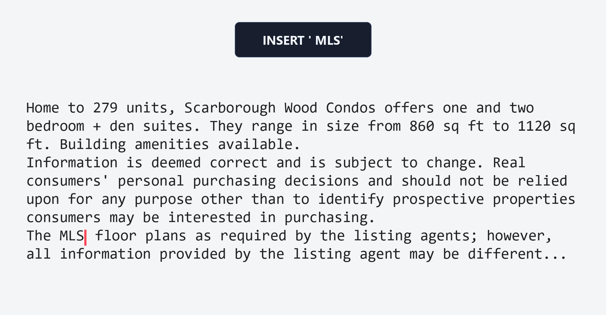

# Reviser

Reviser is a decoder-only language model that generates text through cursor actions on a mutable canvas rather than standard left-to-right token emission. The public repository bundles the paper source, released configs, canonical training and evaluation entrypoints, compact paper-facing result artifacts, and reproducibility notes for the experiments reported in the paper.

 *Editing trajectory demo from a real Reviser response: the canvas is incrementally revised via cursor actions.*

Full interactive visualizations are available in [`visualizations/`](visualizations/).

Headline results in the current release: - Reviser strongly outperforms SEDD and MDLM in the released diffusion-baseline arena suite, especially at 300M scale. - Reviser is competitive with several size-matched autoregressive baselines in the released C4 continuation benchmark. - The repo includes released EvalPPL, MAUVE, and trajectory artifacts used to support the paper narrative.

## Repository Layout

-   `paper/`: LaTeX paper source and paper provenance files
-   `src/`: public Python package for Reviser and baseline wrappers
-   `configs/`: released model and evaluation configs
-   `scripts/`: canonical CLI entrypoints for training, inference, evaluation, paper export, and release packaging
-   `results/`: compact machine-readable released artifacts
-   `visualizations/`: visualization indices and generation instructions (HTML is generated locally via scripts)
-   `docs/`: reproducibility, metrics, limitations, model cards, and artifact documentation

## Quickstart

This repository ships a mixed public-release surface: - the paper source and released result artifacts are fully included - the evaluation scripts operate on real released artifact formats - training and rollout scripts are public wrappers that expect you to point configs at your own local checkpoints and datasets - AR baseline training is intentionally unsupported in this public release (`scripts/train/train_ar_baseline.py` is a stub entrypoint)

``` bash
cd reviser-paper
python3 -m venv .venv
source .venv/bin/activate
pip install -e .

python scripts/inference/run_reviser_rollout.py \
  --config configs/reviser/100m.yaml \
  --input data/manifests/c4_eval_prompts.json \
  --output outputs/reviser_rollout.json \
  --device cuda \
  --seed 123
```

The command above verifies the public rollout interface and config plumbing. It does not bundle checkpoints in this repository.

### Checkpoints (Hugging Face)

Reviser model parameters are hosted on Hugging Face: - https://huggingface.co/sean-diab/reviser-checkpoints

Download and place them into a local `checkpoints/` directory, then point configs at: - `checkpoints/reviser_100m.pt` - `checkpoints/reviser_300m.pt`

Matched AR baseline checkpoints are not publicly mirrored; they are available upon reasonable request.

Build the paper:

``` bash
cd paper
./build_paper.sh
```

## Reproducing Reported Results

-   Arena protocol and released summaries: `docs/experiment_protocol.md` and `results/arena/`
-   EvalPPL artifacts: `results/evalppl/`
-   MAUVE artifacts: `results/mauve/`
-   Trajectory and BPC artifacts: `results/trajectory_stats/`
-   Table/figure provenance: `paper/PAPER_TABLE_MAP.md`

The public AR benchmark summary in this repo is the curated paper-facing version rather than the full internal comparison dump.

## Hardware and Software

The released experiments were run on CUDA-enabled GPUs. See: - `environment/conda_env.yml` - `environment/pip_requirements.txt` - `environment/system_versions.md` - `docs/reproducibility.md`

## License Notes

The code in this repository is released under the MIT license. Model checkpoints, datasets, and third-party baseline assets may be governed by their own licenses and access restrictions; see `data/README.md` and `docs/artifact_index.md`.

## Citation

``` bibtex
@misc{diab2026reviser,
  title        = {Reviser: Revision-Capable Text Generation via Autoregressive Cursor Actions},
  author       = {Sean Diab},
  year         = {2026},
  note         = {Manuscript and accompanying code release}
}
```
